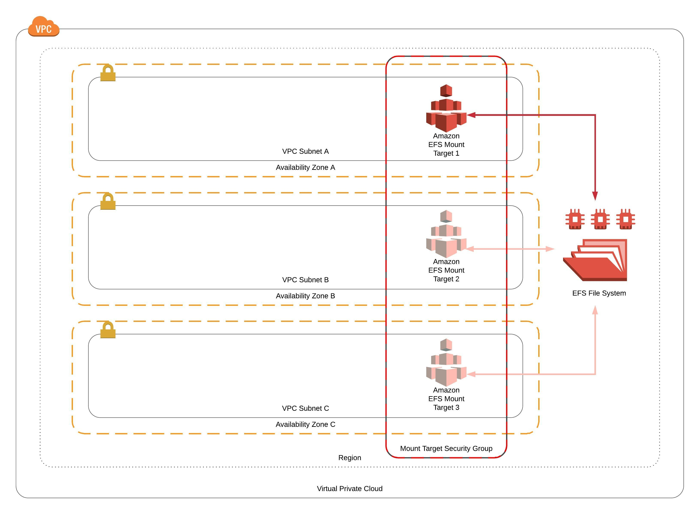

# AWS CloudFormation EFS Example Template

This template is used to create a CloudFormation stack that implements, at a minimum, the following resources:  
* a single EFS FileSystem
* a single Mount Target
* a Security Group associated with the Mount Target(s).  
  
In its current state the template is capable of provisioning up to three Mount Targets associated with the EFS FileSystem.  To provision Mount Targets in addition to the first Mount Target, provide additional subnet-ids in the optional Mount Target 2 and Mount Target 3 subnet parameters.  If you add additional Mount Targets to the configuration, it is recommended that the second and third Mount Targets are provisioned into a subnet that is associated with a different Availability Zone from the subnet associated with the first Mount Target.
                  
The Origin Security Group designated for access to the Mount Target Security Group must exist in a subnet within the same VPC as the Mount Target(s), and/or be routable from within the VPC associated with the Mount Target Security Group."



<br />

## Getting Started
---
At a minimum, access to an AWS Account and permissions to deploy all of the resources defined in the template from the CloudFormation console is required.  If you would like to deploy the template from the commandline, a set of CLI credentials with permissions to deploy all of the resources defined in the template and the installation and configuration of AWS CLI is required.

<br />

## Prerequisites
---
* Installing AWS CLI:  https://docs.aws.amazon.com/cli/latest/userguide/cli-chap-install.html

* Configuring AWS CLI: https://docs.aws.amazon.com/cli/latest/userguide/cli-chap-configure.html

<br />

## Deploying the Template via AWS CLI
---
Create a params.json file to store the template parameter values:
```
[
    "Encryption=true",
    "FileSystemName=JohnDoeTestFS",
    "PerformanceMode=generalPurpose",
    "ThroughputMode=bursting",
    "KmsKeyId=None",
    "VpcId=vpc-0011223344556677"
    "MountTarget1Subnet=subnet-00a1122334455b678",
    "MountTarget2Subnet=None",
    "MountTarget3Subnet=None",
    "FileSharePort=2049",
    "OriginSecurityGroup=sg-0011223344556677"
]
```

Create the tags.json file and populate with all necessary tags.

*Example*:
```
[
    "Business_Unit=1Strategy",
    "Owner=John Doe",
    "Project=Bastion Host"
]
```

Deploy the template to your account:

```
aws cloudformation deploy \
    --template-file efs.yaml \
    --stack-name JohnDoeTestEFS \
    --tags file://tags.json \
    --region "us-east-1" \
    --parameter-overrides file://params.json
```

<br />

## Mounting EFS Mount Targets
---
#### AWS Linux / RHEL / CentOS / Fedora
```
sudo yum -y install nfs-utils
sudo mkdir /mnt/efs
sudo mount -t nfs -o nfsvers=4.1,rsize=1048576,wsize=1048576,hard,timeo=600,retrans=2,noresvport $mount-target-ip-address:/ /mnt/efs
```
<br />

#### Debian / Ubuntu
```
sudo apt-get install -y nfs-common
sudo mkdir /mnt/efs
sudo mount -t nfs
-o nfsvers=4.1,rsize=1048576,wsize=1048576,hard,timeo=600,retrans=2,noresvport $mount-target-ip-address:/ /mnt/efs
```

<br />

## Authors
---
* Will Nave - [1Strategy](https://www.1strategy.com/)

<br />

## License
---
Copyright 2019 1Strategy

Licensed under the Apache License, Version 2.0 (the "License");
you may not use this file except in compliance with the License.
You may obtain a copy of the License at

http://www.apache.org/licenses/LICENSE-2.0

Unless required by applicable law or agreed to in writing, software
distributed under the License is distributed on an "AS IS" BASIS,
WITHOUT WARRANTIES OR CONDITIONS OF ANY KIND, either express or implied.
See the License for the specific language governing permissions and
limitations under the License.

<br />

## References
---
* Amazon Elastic File System Sample Template:  https://docs.aws.amazon.com/AWSCloudFormation/latest/UserGuide/quickref-efs.html
* AWS CloudFormation Best Practices: https://docs.aws.amazon.com/AWSCloudFormation/latest/UserGuide/best-practices.html
* EFS User Guide: https://docs.aws.amazon.com/efs/latest/ug/whatisefs.html
* Mounting EFS Mount Targets using an IP Address: https://github.com/awsdocs/amazon-efs-user-guide/blob/master/doc_source/mounting-fs-mount-cmd-ip-addr.md
